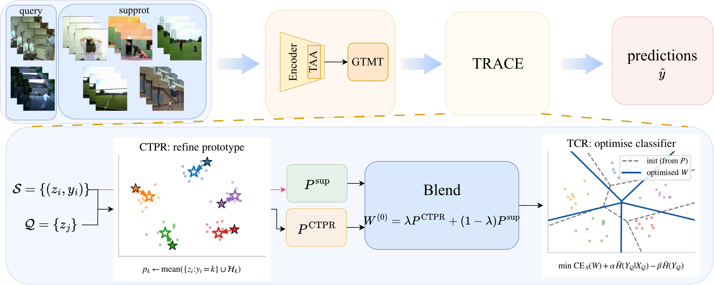

# Closing the Estimation Gap: Training-Free Transductive Inference for Cross-Domain Few-Shot Action Recognition

Official implementation of **TRACE**, a training-free, test-time procedure that
closes a large fraction of the support-vs-oracle estimation gap on cross-domain
few-shot action recognition (CD-FSAR). One frozen backbone, no extra training,
~100 ms per 5-way episode.

> This codebase uses code from
> [TAMT](https://github.com/TJU-YDragonW/TAMT) (Wang *et al.*, CVPR 2025).

<p align="center">
  
</p>

## Abstract
Cross-domain few-shot action recognition (CD-FSAR) aims to recognise unseen action classes in a target domain from only a handful of labelled videos. Despite substantial advances in representation learning, inference in CD-FSAR still relies on prototypes estimated from extremely limited support examples. To assess the impact of this bottleneck, we perform an oracle analysis while keeping the feature representation fixed. Constructing oracle prototypes and decision boundaries using the ground-truth query labels improves 5-way 1-shot accuracy by 7--20 percentage points across five target datasets. This reveals a substantial estimation gap: the representation already contains useful discriminative information, but prototypes and boundaries estimated from scarce supports fail to capture the true class structure of each episode. Motivated by this finding, we propose TRACE, a training-free transductive inference framework that improves episode-level estimation without modifying the backbone. TRACE consists of two complementary stages. Confidence-Thresholded Transductive Prototype Refinement (CTPR) refines support-based prototypes using confidently predicted query videos. The refined prototypes then initialise a lightweight per-episode classifier, which Transductive Classifier Refinement (TCR) further adapts by encouraging confident and class-balanced predictions over the entire query set. Together, the two stages improve prototype and boundary estimation, enabling more effective use of the information already present in the unlabelled queries. Across five target datasets (HMDB51, UCF101, SSv2, Diving48, and RareAct) and both 1-shot and 5-shot settings, TRACE consistently improves a strong CD-FSAR baseline, including gains of more than six percentage points on HMDB51 1-shot, while recovering a substantial fraction of the oracle-estimated gap. These results suggest that improving test-time estimation is a powerful and broadly applicable complement to representation learning for CD-FSAR under extreme support scarcity.

## Highlights

- **Training-free at test time.** The backbone is frozen; TRACE never updates
  it. The full per-episode pipeline runs in ~100 ms on a single GPU.
- **Two complementary refinements.**
  - **CTPR** (Confidence-Thresholded Prototype Refinement) pulls each prototype
    toward its class centre by absorbing the queries it already classifies
    confidently.
  - **TCR** (Transductive Classifier Refinement) initialises a per-episode
    classifier from the refined prototypes and updates it under an
    information-maximisation objective so query predictions are confident and
    class-balanced.
- **Consistent gains across five targets.** HMDB51, UCF101, SSv2, Diving48,
  RareAct. Both K-400 and K-100 sources, both 1- and 5-shot.
- **Portable across heads.** Same procedure improves three different episodic
  heads (TAMT base, ProtoNet-style, GoodEmbed).

## Method at a Glance

TRACE composes two label-free, query-aware steps on top of any frozen
embedding `z`:

```
S = {(z_i, y_i)}      (labelled support)
Q = {z_j}             (unlabelled query)

P_sup  = mean over S, per class                              # raw prototypes
P_ctpr = CTPR(S, Q; τ=0.5, T=3 rounds)                       # absorb high-conf queries
W^(0)  = λ P_ctpr + (1-λ) P_sup,  λ = 0.5                    # blend init
W*     = TCR(W^(0), S, Q;  α=0.1, β=1.0, 100 Adam steps)     # info-max refinement
ŷ_j    = arg max_k ℓ_k(z_j; W*)
```

See `methods/ctpr.py`, `methods/tcr.py`, and `fast_eval.py` for the full
implementation.

## Main Results (5-way, accuracy %)

All results use a VideoMAE ViT-S backbone at 112×112 (the common protocol).
Best per column under that protocol in **bold**.

### Source: Kinetics-400, 5-way 1-shot

| Method | HMDB51 | UCF101 | SSv2 | Diving48 | RareAct | Avg. |
|---|:---:|:---:|:---:|:---:|:---:|:---:|
| TAMT‡ | 58.19 | 86.04 | 41.14 | 32.36 | 46.33 | 52.81 |
| **TRACE (ours)** | **64.81** | **95.35** | **43.56** | **34.15** | **51.09** | **57.79** |

### Source: Kinetics-400, 5-way 5-shot

| Method | HMDB51 | UCF101 | SSv2 | Diving48 | RareAct | Avg. |
|---|:---:|:---:|:---:|:---:|:---:|:---:|
| STARTUP++ | 44.71 | 60.82 | 39.60 | 14.92 | 45.22 | 41.05 |
| DD++ | 48.04 | 63.26 | 44.50 | 16.23 | 47.01 | 43.81 |
| CDFSL-V | 53.23 | 65.42 | 49.92 | 17.84 | 49.80 | 47.24 |
| TAMT‡ | 72.50 | 95.96 | 59.28 | 44.91 | 68.18 | 68.17 |
| **TRACE (ours)** | **74.23** | **97.43** | **61.45** | **45.55** | **69.67** | **69.67** |

### Source: Kinetics-100, 5-way 1-shot

| Method | HMDB51 | UCF101 | SSv2 | Diving48 | RareAct | Avg. |
|---|:---:|:---:|:---:|:---:|:---:|:---:|
| TAMT | 47.02 | 72.38 | 34.45 | 27.04 | 36.04 | 43.39 |
| **TRACE (ours)** | **52.81** | **80.27** | **36.62** | **28.76** | **40.89** | **47.87** |

### Source: Kinetics-100, 5-way 5-shot

| Method | HMDB51 | UCF101 | SSv2 | Diving48 | RareAct | Avg. |
|---|:---:|:---:|:---:|:---:|:---:|:---:|
| TAMT | 61.76 | 87.76 | 48.90 | 38.33 | 52.81 | 57.91 |
| **TRACE (ours)** | **62.99** | **89.11** | **51.23** | **38.83** | **54.08** | **59.25** |

‡ Our reproduction of TAMT. SEEN/DMSD numbers are reported in the paper but
use a different backbone/resolution and are not directly comparable; see the
paper for the full table.

## Environment

Tested with Python 3.6.10, PyTorch 1.9.1, CUDA 11.3.

```bash
conda create -n trace python=3.6.10 -y
conda activate trace
pip install torch==1.9.1+cu111 torchvision==0.10.1+cu111 \
    -f https://download.pytorch.org/whl/torch_stable.html

pip install timm decord einops
pip install -r requirements_all.txt   # full pinned versions
```

Key libraries:
[timm](https://github.com/rwightman/pytorch-image-models),
[decord](https://github.com/dmlc/decord),
[einops](https://github.com/arogozhnikov/einops).

## Data Preparation

This repo follows the same five-dataset CD-FSAR setup as
[TAMT](https://github.com/TJU-YDragonW/TAMT). All five target datasets are
publicly available; download each from its official page and unpack at a
location of your choice. The train/val/test class splits used in the paper
are already encoded under `filelist/`.

### Dataset download links

| Dataset    | Official page | Few-shot split (in this repo) |
|------------|---|---|
| HMDB51     | [serre-lab.clps.brown.edu](https://serre-lab.clps.brown.edu/resource/hmdb-a-large-human-motion-database/) | `filelist/hmdb51-molo/` |
| UCF101     | [crcv.ucf.edu](https://www.crcv.ucf.edu/data/UCF101.php) | `filelist/ucf101-molo/` |
| SSv2       | [qualcomm.com](https://developer.qualcomm.com/software/ai-datasets/something-something) (registration required) | `filelist/SSv2Full/` |
| Diving48   | [svcl.ucsd.edu](http://www.svcl.ucsd.edu/projects/resound/dataset.html) | `filelist/diving48/` |
| RareAct    | [GitHub release](https://github.com/antoine77340/RareAct) | `filelist/rareact_cut/` |

### Pointing the filelists at your data

Each dataset directory under `filelist/` contains JSON splits
(`base.json`, `val.json`, `novel.json`) whose video paths are stored with a
`<DATA_ROOT>` placeholder prefix. After downloading the datasets, run a
single global replace:

```bash
find filelist -name '*.json' -exec sed -i \
    's|<DATA_ROOT>|/absolute/path/to/your/datasets|g' {} +
```

The per-dataset sub-directory layout baked into the filelists matches the
standard MoLo/TAMT release (`HMDB/HMDB51/`, `UCF/`, `ssth100/ssth_otam/smsm_otam/`,
`Diving/rgb/`, `rareact_cut/`, `kinetics100/kinectis100_small/kinetics_100/`).
If your local layout differs, adjust the per-dataset prefixes too.

The few-shot class splits in `filelist/` follow MoLo and TAMT, ensuring
fair comparison.

## Quick Start: TRACE Evaluation in Two Commands

The fastest path to reproducing a single number in the table.

```bash
# 0. Drop the K-400 backbone and the meta-trained ckpt in place
#    (see Checkpoints section below for download links)
mkdir -p model checkpoints/hmdb51
cp <download>/pretrained_k400/vit-s-k400.pt   model/
cp <download>/1shot/hmdb51/best_model.tar     checkpoints/hmdb51/

# 1. Cache TAMT features once for this dataset+shot (~minutes)
python extract_features.py \
    --dataset hmdb51 --data_path filelist/hmdb51-molo \
    --model_path checkpoints/hmdb51/best_model.tar \
    --n_shot 1 --test_n_episode 2000 --test_task_nums 5 \
    --out cached_feats/HMDB51_1shot.pt

# 2. Run TRACE from the cache (~100 ms / episode)
python fast_eval.py --cache cached_feats/HMDB51_1shot.pt \
    --method trace \
    --ctpr_init_w 0.5 --ctpr_iter 3 --ctpr_threshold 0.5 \
    --tcr_iter 100 --tcr_alpha 0.1 --tcr_beta 1.0
```

`fast_eval.py` also supports `--method plain` (raw support prototype),
`--method ctpr` (CTPR only), and `--method tcr` (TCR only), which makes
component ablations a one-liner each.

## Reproducing the Oracle Analysis (Table 1)

The paper motivates TRACE with an oracle analysis: with the features held
fixed, estimating the prototypes and decision boundary from the *true* query
labels gives an upper bound on what any test-time inference can recover. We
report three such Transductive Upper Bounds (TUB):

- **TUB-P** (Proto) — prototype computed from support ∪ half-queries with true
  labels.
- **TUB-C** (Classifier) — multinomial logistic regression trained on
  support ∪ half-queries with true labels.
- **TUB-I** (TCR init) — TCR initialised from the TUB-P prototype.

Run the oracle eval on a cached `.pt` (same cache as `fast_eval.py`):

```bash
python fast_tub.py --cache cached_feats/HMDB51_1shot.pt \
    --n_splits 20 --max_episodes 3000 \
    --out_json logs/tub_HMDB51_1shot.json
```

After looping over the five datasets and two shot settings, aggregate the
JSONs into the paper's Table 1 with:

```bash
python extract_tub.py
```

`tub_clf_oracle.py` is the from-scratch (no-cache) version that decodes
videos via `test.py`'s loader; use it if you do not have a feature cache.

## Reproducing the Complementarity Analysis (Figure 6)

CTPR and TCR are useful in combination only if they make *different* mistakes.
`complementarity.py` quantifies this: it reports the phi-coefficient of
per-query correctness, the oracle-union ceiling (the accuracy a perfect
per-query router between CTPR and TCR could reach), and the disagree-rate
breakdown used in Figure 6.

```bash
python complementarity.py --cache cached_feats/HMDB51_1shot.pt \
    --max_episodes 2000
```

## Reproducing the Full Pipeline

The two-stage K-400 pre-training follows TAMT and is provided for
completeness; the released backbone is the same as TAMT's. For a target
dataset, the meta-training step produces the 1-shot ckpts in this repo and
TAMT releases the 5-shot ckpts.

```bash
# Stage 1: K-400 SSL pre-train (skip if you use the released backbone)
python pretrain.py     ...

# Stage 2: SL post-training on K-400 (skip if you use the released backbone)
python goodembed_pretrain.py   ...

# Stage 3: per-target meta-training (produces the ckpts in the table below)
cd scripts/hmdb51/run_meta_deepbdc && sh run_metatrain.sh
```

The bash scripts under `scripts/<dataset>/run_meta_deepbdc/` show the exact
hyperparameters per target (n_shot, lr, epochs, milestones, n_episode).

## Checkpoints

All checkpoints use VideoMAE ViT-S @ 112×112. K-400 backbone is the TAMT
release; 5-shot meta-trained ckpts are also from TAMT; 1-shot meta-trained
ckpts are from this work.

### Pre-trained backbone

| Model | Source dataset | Checkpoint |
|---|---|---|
| ViT-S (140 epochs) | Kinetics-400, 364 classes | [Download](<https://huggingface.co/TRACE12345/TRACE_ckpts/tree/main/pretrained_k400)>) |

### Meta-trained (5-way 1-shot)

| Dataset  | Accuracy (%, K-400 source) | Checkpoint |
|----------|:--------------------------:|:----------:|
| HMDB51   | 64.81 | [Download](<DRIVE_LINK_1SHOT_HMDB51>) |
| UCF101   | 95.35 | [Download](<DRIVE_LINK_1SHOT_UCF101>) |
| SSv2     | 43.56 | [Download](<DRIVE_LINK_1SHOT_SSV2>) |
| Diving48 | 34.15 | [Download](<DRIVE_LINK_1SHOT_DIVING48>) |
| RareAct  | 51.09 | [Download](<DRIVE_LINK_1SHOT_RAREACT>) |

### Meta-trained (5-way 5-shot, from TAMT)

| Dataset  | Accuracy (%, K-400 source) | Checkpoint |
|----------|:--------------------------:|:----------:|
| HMDB51   | 74.23 | [Download](<DRIVE_LINK_5SHOT_HMDB51>) |
| UCF101   | 97.43 | [Download](<DRIVE_LINK_5SHOT_UCF101>) |
| SSv2     | 61.45 | [Download](<DRIVE_LINK_5SHOT_SSV2>) |
| Diving48 | 45.55 | [Download](<DRIVE_LINK_5SHOT_DIVING48>) |
| RareAct  | 69.67 | [Download](<DRIVE_LINK_5SHOT_RAREACT>) |

## Repository Structure

```
TRACE/
├── pic/fig2_pipeline.png            # framework figure
├── filelist/                        # per-dataset class splits (HMDB/UCF/...)
├── data/                            # video loader + augmentations
├── model/                           # backbone weight container (download here)
├── network/                         # VideoMAE ViT-S + ResNet
├── methods/
│   ├── ctpr.py                      # CTPR: confidence-thresholded refinement
│   ├── tcr.py                       # TCR: info-max classifier refinement
│   ├── template.py, bdc_module.py   # episodic head shared by methods
│   ├── meta_deepbdc.py              # TAMT base method
│   ├── protonet.py, good_embed.py   # alternative heads (used in portability eval)
│   └── tools/                       # MPN / scaling utilities
├── pretrain.py                      # Stage 1: K-400 SSL
├── goodembed_pretrain.py            # Stage 2: K-400 SL post-training
├── meta_train.py                    # Stage 3: per-target meta-training
├── test.py                          # standard episode eval (sanity check)
├── extract_features.py              # cache TAMT features
├── fast_eval.py                     # TRACE eval from cache (the headline method)
├── fast_tub.py                      # TUB-P / TUB-C / TUB-I oracle eval from cache
├── tub_clf_oracle.py                # same oracle, from-scratch (no cache)
├── extract_tub.py                   # aggregate TUB JSONs into Table 1
├── complementarity.py               # per-episode error correlation (Figure 6)
├── utils.py                         # shared loaders / model registry
├── scripts/<dataset>/run_meta_deepbdc/  # training & test bash scripts
├── requirements_all.txt             # pinned environment
└── LICENSE.txt
```

## Citation

If you find TRACE useful for your work, please cite our paper:

```bibtex
@inproceedings{trace2026,
  title     = {Closing the Estimation Gap: Training-Free Transductive Inference for Cross-Domain Few-Shot Action Recognition},
  author    = {<Anonymous for review>},
  booktitle = {Proc. British Machine Vision Conference (BMVC)},
  year      = {2026}
}
```

## Acknowledgements

This codebase uses code from
[TAMT](https://github.com/TJU-YDragonW/TAMT) (Wang *et al.*, CVPR 2025).
